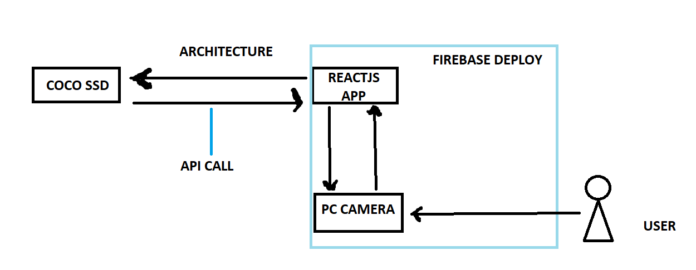
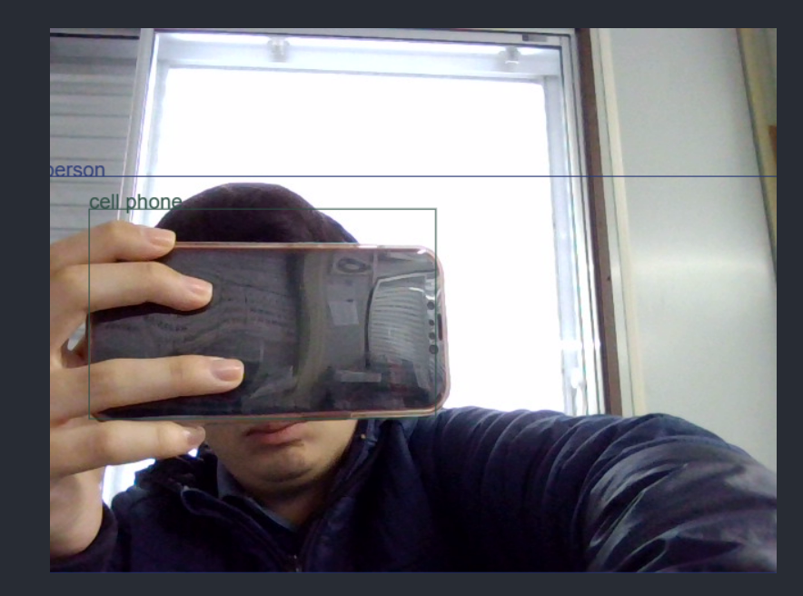

# What is this??

What is this? Vclassifier is a simple application capable of recognizing objects with your PC camera. To do this, it uses a ML model.
Try to test the results! And most importantly, have fun! The app has been developed with react JS

Author: Alejandro Meza Tudela

# Where to try??

**Device**: PC

**Browser**: microsoft edge

**Link**: https://vclassifier.web.app/

## Which kind of ML model does this app uses?

COCO SSD (Common Objects in Context Single Shot Multibox Detection) is an object detection model developed by Google that can detect and classify objects in images or video frames. It is based on a deep convolutional neural network architecture, and it uses the TensorFlow machine learning library.

Here are the steps that COCO SSD takes to detect objects:

- Image Preprocessing: The input image is resized to a fixed size and normalized to have values between 0 and 1.

- Feature Extraction: The image is passed through a convolutional neural network to extract features. The network used by COCO SSD is called MobileNetV1, which is a lightweight and efficient network designed for mobile devices.

- Multibox Generation: The feature maps obtained from the previous step are used to generate a set of bounding boxes that may contain objects. This is done using a technique called anchor boxes, which are predefined boxes of different sizes and aspect ratios that are placed at each position on the feature maps.

- Object Classification: For each of the generated bounding boxes, COCO SSD predicts the probability of each object class using a set of learned weights. The classes that COCO SSD can detect include people, animals, vehicles, and various household objects.

- Non-Maximum Suppression: Since multiple bounding boxes may overlap for the same object, COCO SSD uses a technique called non-maximum suppression to remove redundant boxes and keep only the most likely one.

- Output: The final output of COCO SSD is a list of bounding boxes and their associated class labels and confidence scores.

Overall, COCO SSD is a powerful and efficient model for object detection that can be used for a wide range of applications, from robotics and autonomous vehicles to security and surveillance systems.

# Architecture

# Demo

This a picture of the way this app works. 

